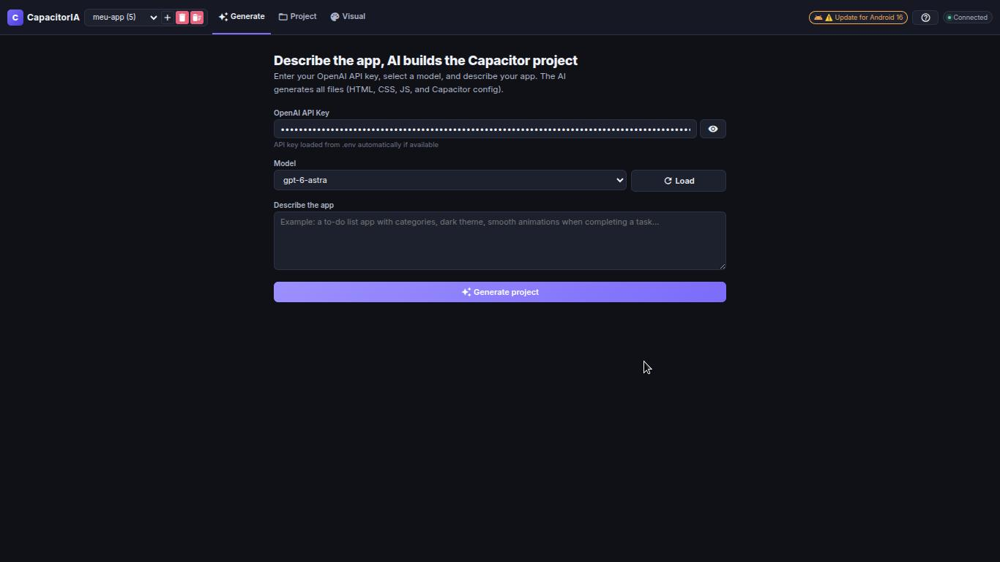
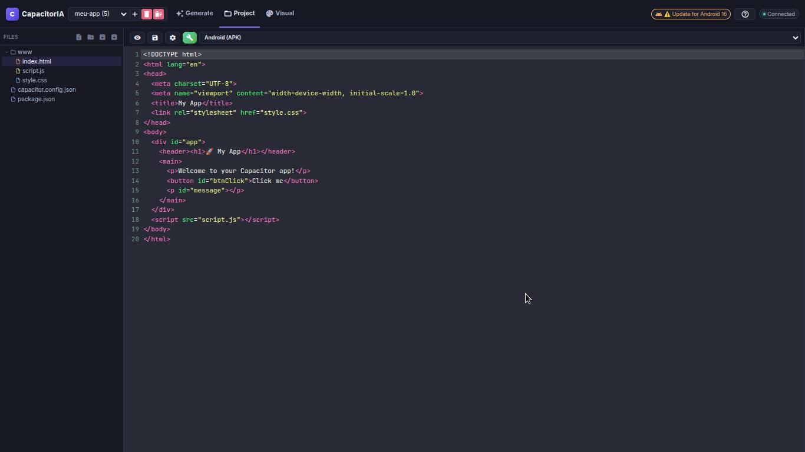
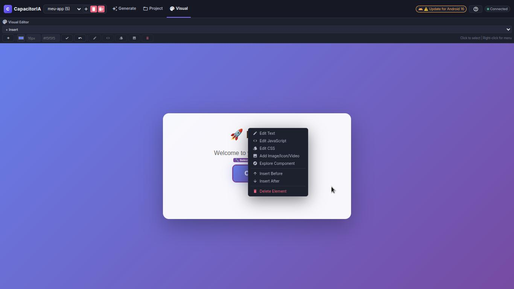
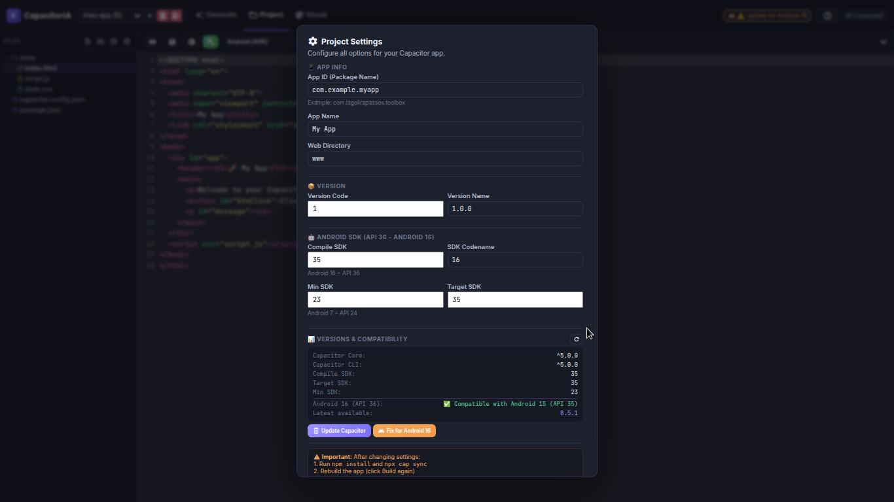

# CapacitorIA Studio 🚀

**Build Native Mobile Apps with AI-Powered Development**

[](https://github.com/iagolirapasssos/CapacitorIA-Studio)
[](https://nodejs.org/)
[](LICENSE)
[](http://makeapullrequest.com)

## 📱 What is CapacitorIA Studio?

CapacitorIA Studio is a powerful IDE and development environment that combines **AI-assisted code generation** with **visual editing** to create native mobile applications using [Capacitor](https://capacitorjs.com/). Build Android and iOS apps without leaving your browser!

### ✨ Key Features

- **🤖 AI-Powered App Generation** - Describe your app in natural language and let AI generate complete Capacitor projects
- **🎨 Visual Editor** - Click, select, and edit HTML elements visually with real-time preview
- **📝 Code Editor** - Full-featured CodeMirror editor with syntax highlighting for HTML, CSS, and JavaScript
- **🔨 One-Click Build** - Generate APK, AAB, and IPA files directly from the interface
- **📦 Project Management** - Create, import, export, and switch between multiple projects
- **🔄 Live Preview** - See changes instantly in the built-in preview panel
- **🧠 AI Code Editing** - Select any component and use AI to modify its JavaScript or CSS
- **📊 Android 16 Support** - Full compatibility with API 36 (Android 16) and backward compatibility to Android 7 (API 24)
- **🎯 Component References** - Find where elements are used across your project files
- **🖼️ Asset Management** - Add images, icons, videos, and animations with drag & drop support
- **↩️ Undo/Redo** - Full undo/redo support (Ctrl+Z / Ctrl+Y) in the visual editor

---

## 🚀 Quick Start

### Prerequisites

- [Node.js](https://nodejs.org/) (v18 or later)
- [npm](https://www.npmjs.com/) (v9 or later)
- [Android Studio](https://developer.android.com/studio) (for Android builds)
- [Xcode](https://developer.apple.com/xcode/) (for iOS builds - macOS only)
- [Java JDK 17+](https://adoptium.net/) (for Android builds)

### Installation

```bash
# Clone the repository
git clone git@github.com:iagolirapasssos/CapacitorIA-Studio.git
cd CapacitorIA-Studio

# Install dependencies
npm install

# Configure environment variables
cp .env.example .env
# Edit .env with your OpenAI API key

# Start the server
npm start
```

### Environment Variables

Create a `.env` file in the root directory:

```env
# OpenAI API Key (required for AI features)
OPENAI_API_KEY=sk-proj-xxxxxxxxxxxxxxxxxxxxxxxxxxxxxxxx

# Server Configuration
PORT=3000
NODE_ENV=development

# Project Storage Path
PROJECTS_ROOT=./projects
```

### Access the Application

Open your browser and navigate to:
```
http://localhost:3000
```

---

## 📖 Documentation

### 1. Generate Tab

Create a new Capacitor project using AI:

1. **Enter your OpenAI API key** (if not loaded from `.env`)
2. **Click "Load Models"** to fetch available OpenAI models
3. **Select a model** (recommended: gpt-4o-mini for speed, gpt-4o for quality)
4. **Describe your app** in detail
5. **Click "Generate Project"** - AI will create all necessary files

**Example prompt:**
```
Create a to-do list app with:
- Dark theme
- Categories for tasks
- Smooth animations when completing tasks
- A productivity summary at the top
- Persistent storage using localStorage
```

### 2. Project Tab

Edit and manage your project files:

- **File Tree** - Browse all project files
- **Code Editor** - Edit HTML, CSS, and JavaScript with syntax highlighting
- **Preview Panel** - See your changes in real-time (click 👁️ to open)
- **Build** - Generate APK, AAB, or IPA files with one click
- **Import/Export** - Import `.zip` projects or export your current project

#### Building Your App

1. **Select a platform** (Android APK, Android AAB, or iOS IPA)
2. **Click "Build"** - The build process starts with progress tracking
3. **Download** - When complete, a download modal appears with your build files

### 3. Visual Tab

Edit your app visually with a WYSIWYG experience:

#### Selecting Elements
- **Left-click** any element to select it
- **Double-click** to clear selection
- **Right-click** for context menu

#### Context Menu Options

| Option | Description |
|--------|-------------|
| ✏️ Edit Text | Change the text content of the selected element |
| 💻 Edit JavaScript | Open the code editor for the element's JavaScript |
| 🎨 Edit CSS | Open the code editor for the element's CSS |
| 🖼️ Add Asset | Add images, icons, videos, or animations |
| 🔍 Explore Component | Find where this element is referenced in your project |
| ⬆️ Insert Before | Insert a new HTML element before the selected one |
| ⬇️ Insert After | Insert a new HTML element after the selected one |
| 🗑️ Delete | Remove the selected element |

#### Adding Assets

1. **Select an element** in the visual editor
2. **Right-click** → **Add Asset**
3. **Choose asset type**: Image, Icon, Video, or Animation
4. **Provide source**: Upload a file or enter a URL
5. **Set optional dimensions** (width/height)
6. **Click "Add Asset"** - The asset is added to your project

#### Keyboard Shortcuts

| Shortcut | Action |
|----------|--------|
| `Ctrl+Z` | Undo last change |
| `Ctrl+Y` / `Ctrl+Shift+Z` | Redo |
| `Ctrl+S` | Save current file |
| `Ctrl+Shift+C` | Open Project Settings |

---

## 🔧 Advanced Features

### AI-Powered Code Editing

1. **Select a component** in the visual editor
2. **Right-click** → **Edit JavaScript** or **Edit CSS**
3. **Click "Edit with AI"**
4. **Describe the change** you want
5. **Review and apply** the AI-generated code

The AI will modify ONLY the code related to the selected component, leaving the rest untouched.

### Project Configuration

Click the ⚙️ **Settings** button to configure:

- **App ID** (Package Name) - e.g., `com.iagolirapassos.toolbox`
- **App Name** - Display name of your app
- **Version Code** - Internal version number
- **Version Name** - User-facing version (e.g., `1.0.0`)
- **Android SDK** - Compile, Target, and Min SDK versions
  - Default: Compile 36 (Android 16), Target 36, Min 24 (Android 7)

### Android 16 (API 36) Compatibility

CapacitorIA Studio supports the latest Android version out of the box:

- **Compile SDK**: 36 (Android 16)
- **Target SDK**: 36 (Android 16)
- **Min SDK**: 24 (Android 7)

You can customize these values in the Project Settings.

### Component References

Find all occurrences of a component across your project:

1. **Select an element** in the visual editor
2. **Right-click** → **Explore Component**
3. The modal shows all files referencing this component
4. **Click the preview** to open the file in the code editor

---

## 🛠️ Development

### Project Structure

```
CapacitorIA-Studio/
├── public/
│   └── index.html          # Main application interface
├── server/
│   ├── index.js            # Express server with WebSocket
│   ├── services/
│   │   ├── buildService.js # APK/AAB/IPA build service
│   │   └── fileService.js  # File management service
│   └── utils/
│       └── logger.js       # Logging utilities
├── projects/               # All projects are stored here
├── .env                    # Environment variables
├── package.json
└── README.md
```

### Running in Development Mode

```bash
npm run dev
```

This starts the server with auto-reload using nodemon.

### Building for Production

```bash
npm run build
```

### Firebase Hosting Deployment

```bash
# Install Firebase CLI
npm install -g firebase-tools

# Login to Firebase
firebase login

# Deploy
firebase deploy
```

---

## 🤝 Contributing

We welcome contributions! Please see our [Contributing Guidelines](CONTRIBUTING.md).

1. **Fork** the repository
2. **Create a feature branch** (`git checkout -b feature/amazing-feature`)
3. **Commit your changes** (`git commit -m 'Add amazing feature'`)
4. **Push to the branch** (`git push origin feature/amazing-feature`)
5. **Open a Pull Request**

---

## 📄 License

This project is licensed under the **Apache License 2.0** - see the [LICENSE](LICENSE) file for details.

```
Copyright 2024 Francisco Iago Lira Passos

Licensed under the Apache License, Version 2.0 (the "License");
you may not use this file except in compliance with the License.
You may obtain a copy of the License at

    http://www.apache.org/licenses/LICENSE-2.0

Unless required by applicable law or agreed to in writing, software
distributed under the License is distributed on an "AS IS" BASIS,
WITHOUT WARRANTIES OR CONDITIONS OF ANY KIND, either express or implied.
See the License for the specific language governing permissions and
limitations under the License.
```

---

## 🐛 Troubleshooting

### Build Errors

#### Kotlin Version Conflicts

If you see duplicate class errors related to Kotlin:

1. Update Capacitor dependencies:
   ```bash
   cd projects/your-project
   npm install @capacitor/core@latest @capacitor/cli@latest
   npx cap sync
   ```

2. Or use the "Fix for Android 16" button in Project Settings

#### Android Studio Not Found

Set the `CAPACITOR_ANDROID_STUDIO_PATH` environment variable:

```bash
export CAPACITOR_ANDROID_STUDIO_PATH=/path/to/android-studio/bin/studio.sh
```

### API Key Issues

#### "Incorrect API key provided"

1. Check your `.env` file - ensure the key is correct and has no extra spaces
2. Verify the key format starts with `sk-proj-`
3. Test the key directly:
   ```bash
   curl -H "Authorization: Bearer YOUR_KEY" https://api.openai.com/v1/models
   ```

#### "API key not configured"

1. Ensure `.env` exists in the project root
2. Restart the server after adding the key
3. Check server logs for key loading status

### Visual Editor Not Selecting Elements

1. Ensure the visual editor tab is active
2. Click directly on elements in the preview
3. Try double-clicking to clear selection first
4. Check browser console for errors

---

## 🗺️ Roadmap

- [ ] Hot reload for visual editor changes
- [ ] Plugin marketplace for Capacitor
- [ ] Real-time collaboration
- [ ] More AI models support (Claude, Gemini)
- [ ] iOS Simulator integration
- [ ] Automated testing integration
- [ ] Push notification configuration
- [ ] Deep linking support

---

## 🙏 Acknowledgments

### Core Technologies

- **[Capacitor](https://capacitorjs.com/)** - The amazing cross-platform native runtime that makes this all possible. Thank you to the Ionic team for building such an incredible tool!
- **[CodeMirror](https://codemirror.net/)** - The flexible code editor component
- **[OpenAI](https://openai.com/)** - AI models for code generation and editing
- **[Google Material Icons](https://fonts.google.com/icons)** - Beautiful icon library
- **[Express.js](https://expressjs.com/)** - Web framework for the server
- **[WebSocket](https://developer.mozilla.org/en-US/docs/Web/API/WebSocket)** - Real-time communication

### Special Thanks

- The entire Capacitor community for their continuous support and contributions
- All contributors who have helped shape this project
- The open-source community for providing the tools that make this possible

---

## 📞 Support

- **Issues**: [GitHub Issues](https://github.com/iagolirapasssos/CapacitorIA-Studio/issues)
- **Documentation**: [Wiki](https://github.com/iagolirapasssos/CapacitorIA-Studio/wiki)
- **Email**: iagolirapassos@gmail.com

---

## ⭐ Star History

If you find CapacitorIA Studio useful, please consider giving it a ⭐ on GitHub!

[](https://star-history.com/#iagolirapasssos/CapacitorIA-Studio&Date)

---

## 📸 Screenshots

<!-- Add screenshots here -->
### Generate Tab


### Project Tab


### Visual Editor


### Config


---

**Built with ❤️ for the Capacitor community**

Made with passion by [Francisco Iago Lira Passos](https://github.com/iagolirapasssos) and contributors.